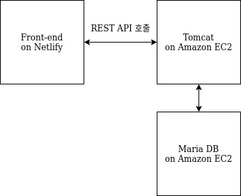

# To-do list API server
To-do list app을 만들기 위해 필요한 REST API들을 제공하는 서버입니다. 할일 추가, 삭제 프로젝트 추가, 삭제 회원가입, 로그인 API 등을 제공합니다.
front-end의 자세한 사항을 아래 링크에서 확인할 수 있습니다.  
[https://github.com/inherithandle/todo-list-frontend](https://github.com/inherithandle/todo-list-frontend)

### Architecture
  
front-end는 Netlify에 배포되어 있습니다. 유저는 브라우저로 Netlify 도메인으로 페이지에 접속합니다.
로그인 버튼을 누르면 유저 정보를 파라미터로 하여 back-end 서버의 login API를 호출합니다. HTTPS로 연결하여 안전하게 API를 호출할 수 있으며, 유저의 패스워드를 암호화하여 안전하게 MariaDB에 저장합니다.
back-end 서버는 amazon ec2 t2.nano로 호스팅합니다. 
### 서버 스케일링 전략
현재 서버 구조는 front-end는 Netlify에 위치하고, back-end 서버와 MariaDB는 같은 EC2 instance에 위치하고 있습니다.
다만, 유저가 많아 지는 경우, EC2 instance 등급을 업그레이드 하고, Maria DB와 Tomcat을 아래와 같이 분리 예정입니다.  
  
유저의 접속이 훨씬 더 많아 지는 경우, replica DB를 두어 읽기 쿼리와, 쓰기, 삭제 쿼리의 부하를 분리할 예정입니다.
디비 쿼리의 분산은 @Transactional(readonly = true | false) 애노테이션으로 가능합니다. 아직은 구현하지 않았습니다.  
  
### 실행 방법
```bash
    git clone https://github.com/inherithandle/todo-list-backend.git
    cd todo-list-backend
    ./gradlew bootRun
```
구글 로그인 기능을 사용하려면 본인의 google client id, client secret을 추가 해줘야 사용할 수 있습니다. application-oauth.properties에 추가해주세요.
### Stack
* Spring Framework
* JPA, Hibernate
* In-memomry H2 database
* MariaDB
* Gradle (Tooling)

